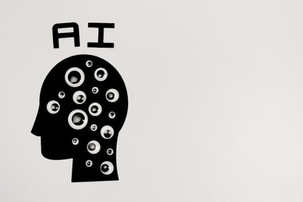

Search engine optimisation (SEO) has grown in importance as a component of online marketing strategies in the current digital era. Artificial intelligence (AI), a potent tool that has multiple effects on SEO, has emerged in the ever-evolving technological scene. The way search engines rank websites, interpret user intent, and deliver pertinent search results has been completely transformed by AI algorithms. We will examine the relationship between AI and SEO in this article and look into how AI affects the optimisation process.

## Enhancing Search Engine Algorithms

Search engines, such as Google, are constantly working to enhance their algorithms to give users the most accurate and worthwhile search results. By analysing massive volumes of data, gaining insight from user behaviour, and adjusting to shifting patterns, AI significantly contributes to improving these algorithms. It is crucial for businesses to stay up-to-date with the most recent AI-driven SEO techniques because search engines can now understand complex search queries better, interpret user intent more precisely, and give highly relevant search results. Following these trends will be critical to success.

## Improving User Experience

User experience (UX) is now a key component of SEO as well. By delivering tailored and contextually relevant content, AI-powered technologies like natural language processing and machine learning have significantly enhanced the user experience. Websites are able to provide specialised information and recommendations by using AI algorithms to analyse user behaviour and find trends and preferences. Companies must embrace the power of AI to create outstanding user experiences that fuel their search engine optimisation efforts as this not only increases user pleasure but also the likelihood of conversions and customer loyalty.

## Identifying Potential Issues

Tools with AI capabilities can be quite useful for spotting potential SEO issues and speeding up optimisation. An [effective SEO crawler](https://www.seoptimer.com/seo-crawler/), for instance, is necessary to find technical problems that might influence a website's functionality and search engine rankings. Utilising a great crawler tool to conduct thorough website audits on a regular basis aids in locating duplicate content, broken links, and other technical issues that impede SEO efforts. This makes it possible for companies to be proactive and keep a strong optimisation environment.

## Voice Search Optimisation

The development of virtual assistants and smart speakers has had a big impact on how consumers look for information. Due to the fact that voice search optimisation demands a different strategy than conventional text-based search, it has grown to be an essential part of SEO. By comprehending natural language, speech patterns, and user intent, [AI is essential to voice search](https://ideasplusbusiness.com/artificial-intelligence-for-seo-success/). Using conversational keywords, offering succinct responses to frequently asked inquiries, and making sure your website is mobile-friendly are all components of content optimisation for voice search. Firms can increase their exposure and draw more organic visitors by implementing AI-driven voice search optimisation tactics.

## Streamlining Content Creation

In the world of SEO, content reigns supreme, and AI has significantly streamlined the content production process. AI-powered systems are capable of producing high-quality content, conducting content audits, and optimising already-existing content. Organisations can save time and resources by using natural language-generating algorithms to create articles, blog posts, and product descriptions. To guarantee authenticity, relevance, and brand identity, a balance between human- and AI-generated content must be maintained. To preserve a distinctive and appealing brand voice, [businesses should use AI](https://www.atulhost.com/the-disruptive-impacts-of-artificial-intelligence-on-businesses) to automate regular content generation chores while still combining human creativity, experience, and a personal touch.

In conclusion, the world of digital marketing has been completely transformed by the merger of AI and SEO. Businesses must modify their SEO strategy to keep up with the improvements in AI as it progresses. Organisations can increase their online exposure, draw in more organic traffic, and stay one step ahead of the competition by utilising the power of artificial intelligence.

### Contact Phillip Quay

**Email** Phillip@mediapa.co.nz

**Mobile** 027 458 7724

www.nzbusinessconnect.co.nz 

[facebook.com/nzbusinessconnect](https://www.facebook.com/profile.php?id=100082975520080)